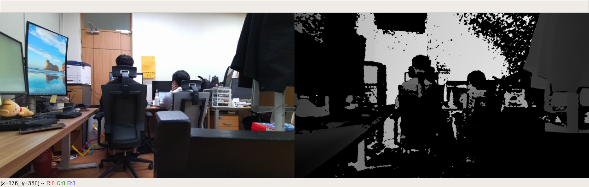
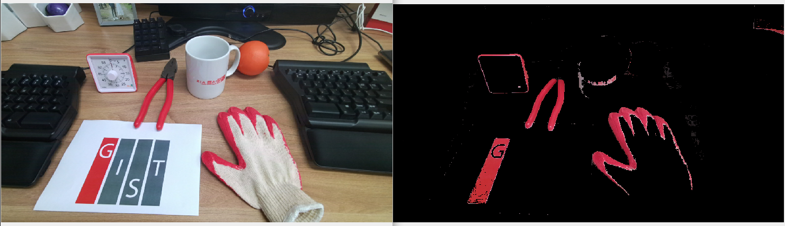
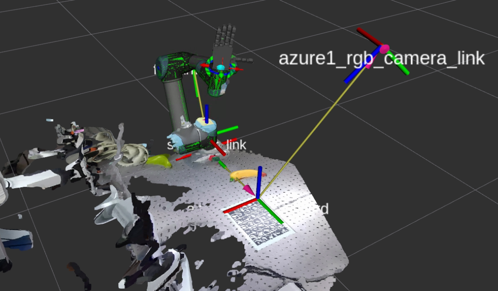
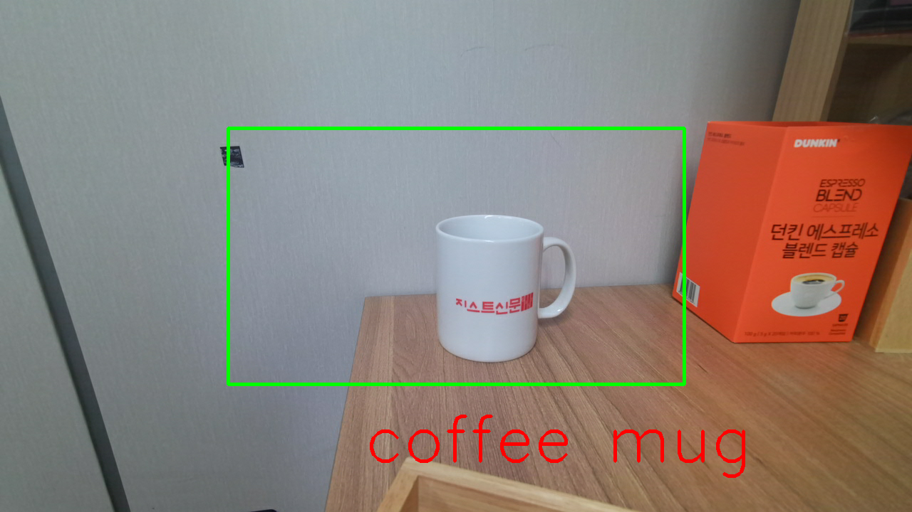
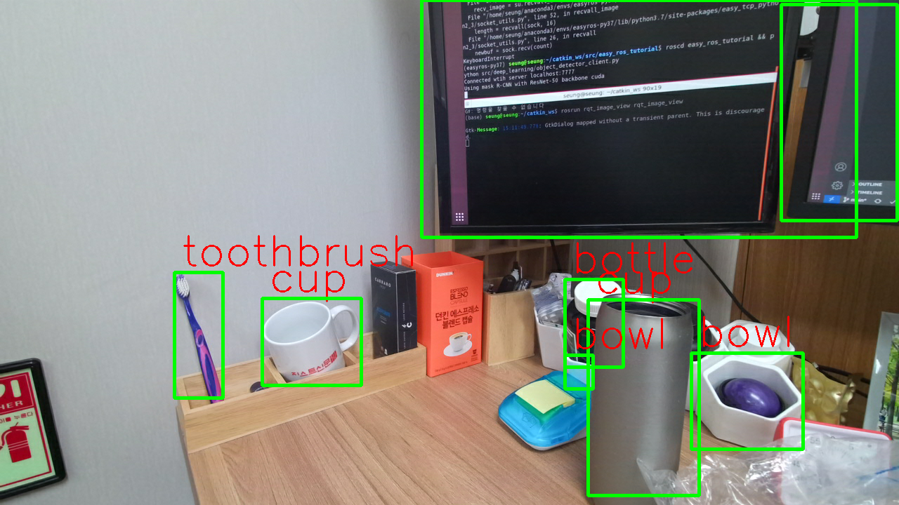

# Easy ROS Tutorial

- Play with ROS! Tutorials and examples of ROS and Python
- Learn to handle camera and robot using ROS

## Table of Contents

1. [Environment Setup](./EnvSetup.md)
2. [Camera](./src/camera/README.md)
- [rgbd capture](./src/camera/rgbd_capturer.py)  

- [color detection](./src/camera/color_detector.py)   

- [extrinsic calibration](./src/camera/README.md)   

- [pointcloud processing](./src/camera/pointcloud_processor.py)   

3. [Deep Learning](./src/deep_learning/README.md)
- [image classification](./src/camera/img_classifier.py)  

- [object detection](./src/deep_learning/object_detector.py)  

## Coming next..

- pointcloud
- Moveit

## Authors
* **Seunghyeok Back** [seungback](https://github.com/SeungBack)
